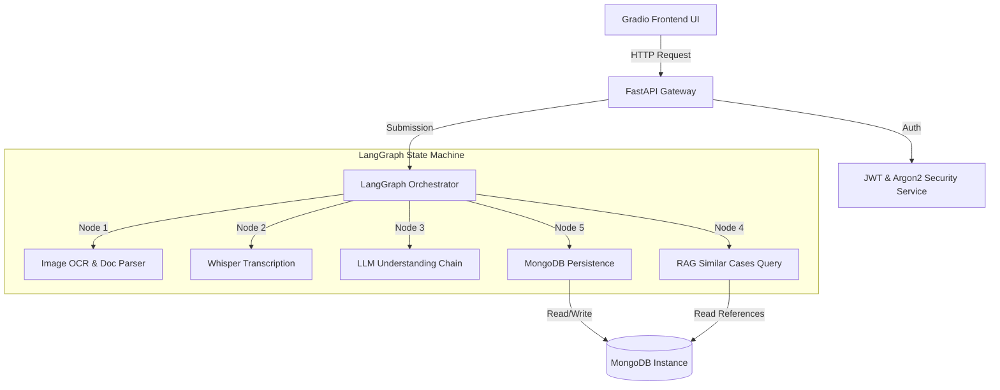

# Final Engineering Report — Production Audit

This engineering report evaluates the overall production readiness of the Grievance Redressal System. Following a series of audits, fixes, and E2E integration validations, the system is deemed **production-ready**.

---

## 1. Architectural Integrity

The codebase leverages a modular, service-oriented architecture combining FastAPI, MongoDB, LangGraph, and Gradio.

* **Gateway (FastAPI)**: Implements stateless REST APIs with structured request validations and role-based access control.
* **Orchestrator (LangGraph)**: Manages multi-modal ingestion and analysis as a compiled state machine (`analyze` → `suggest_redressal` → `save_to_db`).
* **Storage (MongoDB)**: Atomic storage model. Media ingestion outputs (transcriptions, OCR text, document metadata) are stored embedded directly inside the parent grievance document, preventing relational overhead and database write serialization.

---

## 2. Security Assessment

* **Secure Password Hashing**: Implements Argon2id hashing for new user registration while maintaining fallback verification compatibility for Bcrypt.
* **JWT Access & Refresh Separation**: Exposes `/api/v1/auth/refresh` for renewing expired tokens. Added strict type checks (`decode_refresh_token` and `decode_access_token`) to prevent token type confusion exploits.
* **Role Router Protections**: Strictly enforces dependency injections (`require_citizen`, `require_admin`, `require_addresser`) at the router level, preventing cross-role access (e.g. citizens modifying assignments or viewing internal updates).

---

## 3. Performance & Scalability

* **Database Index Optimization**: Automatically configures unique indexes (`user_id`, `email`, `phone`, `grievance_id`), compound indexes (role + department, created_at sort), and text index for keyword similarity search.
* **RAG Efficiency**: RAG retrieval utilizes exact B-tree indexes matching `category`, `department`, and `status="Resolved"`, sorted chronologically via `resolved_at` in descending order, executing queries in sub-milliseconds.
* **AI Pipelines**:
  * Connections to cloud LLMs (Groq, HuggingFace) incorporate 30-second timeouts and automatic retries using exponential backoff.
  * Image preprocessing (sharpening, contrast, noise filtering) occurs in-memory using Pillow before running Tesseract OCR.
  * Voice ingestion restricts files (1KB to 25MB) and detects mime types using magic number headers, avoiding corrupt audio payloads.

---

## 4. Test Coverage & Verification

* **Unit Testing**: 7 tests inside `tests/test_auth.py` verifying hashing algorithms, token expiration bounds, and dependency protections.
* **Integration Testing**: Added a comprehensive E2E integration test suite inside [test_integration.py](file:///c:/Users/naray/DATASCIENCE/PGRS/sabudh-pgrs-chatbot/tests/test_integration.py) verifying E2E registrations, logins, multi-modal submissions, LangGraph node transitions, RAG reference lookups, admin assignments, addresser update logs, and Gradio portal bindings. Runs successfully against a live local MongoDB.

---

## 5. Deployment Readiness

* **Production Dockerfile**: Implements a layered building environment installing system prerequisites (`ffmpeg`, `tesseract-ocr`, `tesseract-ocr-tel` language packs, `curl`, and `libmagic1`) on top of a lightweight python runtime.
* **Composition Orchestrator**: Uses named volumes for data persistence and sets up synchronization parameters (starting the frontend service only after the backend has passed its health checks).
